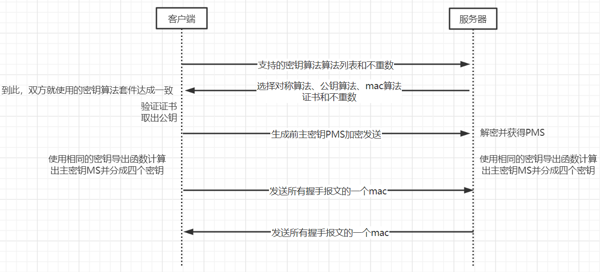

## 握手协议  
双方拿到对方的证书，取出公钥，最终协商出一个共享密钥。  

## 在握手过程最后，为什么要发送消息认证码？  
在握手协议的前两步，是铭文通信，如果有人将客户端所支持的密钥算法套件中的安全级别较高的算法改为低强度算法，从而减小入侵者的破解难度。所有为了防止这种篡改，在后面向对方发送MAC。  

## 不重数有什么用？
每次的SSL连接使用不同的不重数，而通信主密钥是由不重数和前主密钥PMS产生，即使两次通信的PMS相同，而不重数不同产生的子密钥也不同。如果服务器接收到来自客户端SSL连接记录的重放，该记录无法通过完整性校验。总之不重数用来防御连接重放攻击。